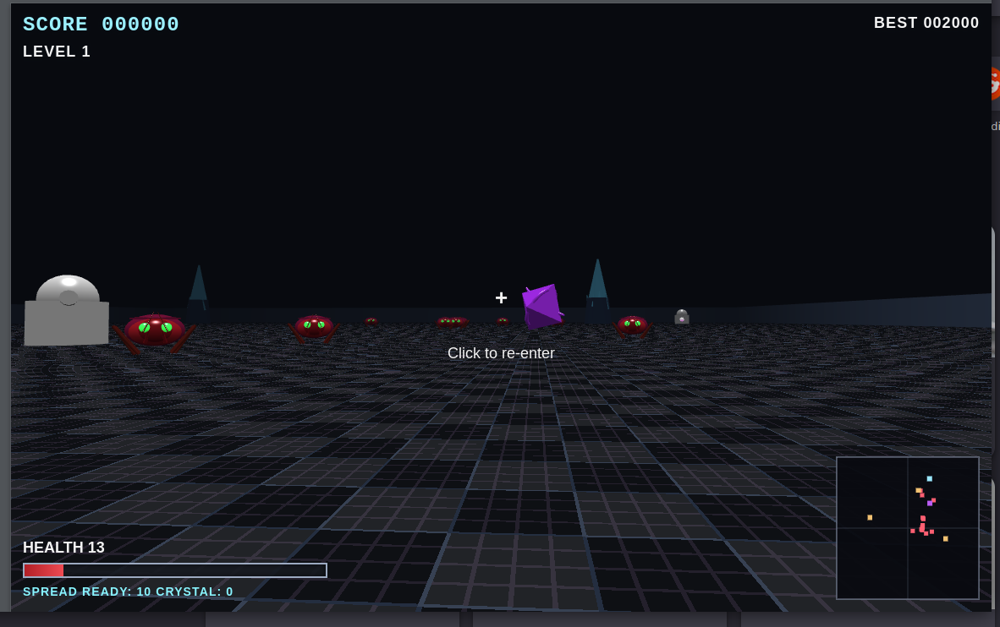

# Retro Flatland Shooter

A browser-based retro 3D arcade shooter inspired by early flat-plane 3D visuals: a large flat arena, strong ground patterns for orientation, sparse geometric landmarks, punchy projectile combat, and synthetic arcade-style sound.



## About this project

This is an experiment to see what Babylon.js can do with AI assistance. I'm not writing much code here—mostly just describing what I want, and in some cases using images as references. For example, I pasted an image of a bug and asked AI to create the enemy, and it just did it. It's pretty interesting. This isn't meant to be an amazing game, but rather a demonstration of what AI can help build. Created around February 2025.

## Stack

- TypeScript
- Vite
- Babylon.js

## Project philosophy

This repo is **spec-first**. The `specs/` folder is the source of truth for game behavior, technical boundaries, and implementation milestones. Code generation agents should read the specs before changing runtime code.

## How to run

```bash
npm install
npm run dev
```

## Expected workflow

1. Read `AGENTS.md`
2. Read `PRODUCT.md`
3. Read `specs/00-project-vision.md`
4. Read `specs/04-technical-architecture.md`
5. Implement one task from `specs/16-task-breakdown.md`
6. Verify against `specs/15-testing-and-acceptance.md`

## Current milestone

Initial repo scaffold only. The implementation files are placeholders intended to guide Codex or another coding agent.

## Repo layout

- `specs/` — design and engineering specs
- `src/` — implementation code
- `public/` — audio and textures
- `tests/` — smoke and unit tests

## Commands

```bash
npm run dev
npm run build
npm run preview
npm run typecheck
```
